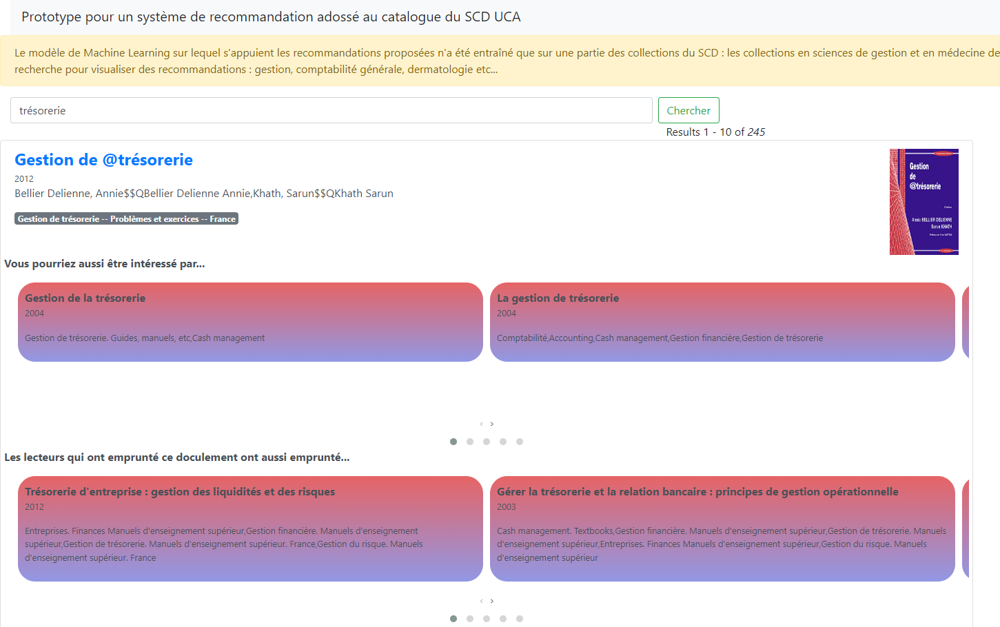

POC de Machine Learning appliqué aux bibliothèques : moteur de recommandations adossé à l'Opac
========================================================

## Modèle de ML

### Objectif

Calculer des proximités de contenus et d'usage entre des notices bibs afin de développer un système de recommandations.

### Problématique et données

Les différents jeux de données (données sources et données retraitées) sont dans le dossier /notebooks/data.

La problématique, ses enjeux et sa résolution ont été documentés dans une série de 4 billets sur le Blog d'Etienne Cavalié : [https://bibliotheques.wordpress.com/2019/11/04/ia-et-opac-mettre-en-place-un-moteur-de-recommandation-dans-un-opac-1-4-quelques-bases-conceptuelles/](https://bibliotheques.wordpress.com/2019/11/04/ia-et-opac-mettre-en-place-un-moteur-de-recommandation-dans-un-opac-1-4-quelques-bases-conceptuelles/) et suivants.

### Préparation des données (data processing)

1. Pour les recommandations basées sur le contenu des ressources (similarité de type content-based) : /notebooks/content_based_filtering.ipynb
2. Pour les recommandations basées sur les usages (collaborative filtering) : /notebooks/collaborative_filtering.ipynb

A noter que concernant les recommandations à partir des usages de prêt, une modélisation en réseau bipartite (avec 2 types de noeuds représentant des documents et des lecteurs) a été privilégiée en stockant les données dans une base de données orientée graphe Neo4j.

## Application Python Flask

Cette applicaton web exploite l'API du logiciel Primo (l'Opac du SCD UCA) ainsi que le modèle de ML lui-même rendu accessible via un web service, pour fournir une interface personnalisée (et un peu rustique) de catalogue de bibliothèque intégrant pour chaque item des listes de résultats des recommandations de documents "proches".

### Accès

L'application est déployée et accessible ici :

[http://azur-scd.com/apps/poc-recommandations-engine](http://azur-scd.com/apps/poc-recommandations-engine)

(peut mettre un certain temps à se lancer en raison du temps de chargement du modèle sérialisé)

    
